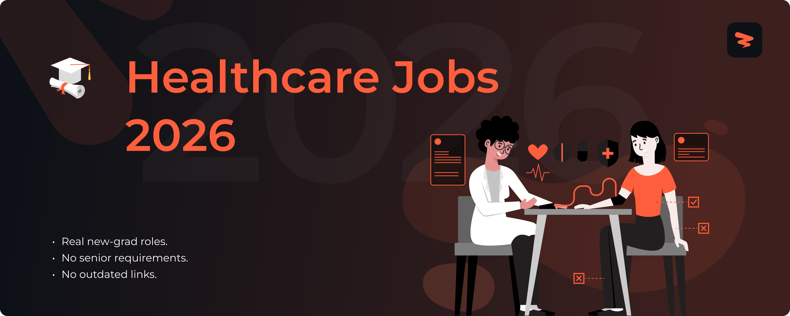

<!-- Banner -->

# Healthcare Jobs 2026

🚀 Healthcare and nursing jobs for new graduates, updated in real time.

> [!TIP]
> 🛠 Help us grow! Add new jobs by submitting an issue! View contributing steps [here](CONTRIBUTING-GUIDE.md).

---

  
  &nbsp;&nbsp;&nbsp;&nbsp;
  

---

  
  &nbsp;&nbsp;
  
  &nbsp;&nbsp;
  

---

<h3>🏥 <strong>Registered Nurse</strong></h3>

| Company | Role | Location | Posted | **Apply** |
|---------|------|----------|--------|----------|
| 🏢 **WVU Medicine** | UHC-Patient Care Tech (PCT) Day Shift-6 North-Med Surge/Step Down | United Hospital C... | 35m |  |
| 🏢 **WVU Medicine** | UHC-Patient Care Tech (PCT) Day Shift - 6 North-Med Surge/Step Down | United Hospital C... | 35m |  |
| 🏢 **Takeda** | Plasma Center Nurse - RN - Sign-On Bonus Eligible | GA - Kennesaw | 35m |  |
| 🏢 **Takeda** | Plasma Center Nurse - EMT - Evening & Weekend Availability | MI - Ypsilanti | 35m |  |
| 🏢 **Takeda** | Plasma Center Nurse - LPN - Evening & Weekend Availability | MI - Ypsilanti | 35m |  |
| 🏢 **Mass General Brigham** | Medical Surgical ICU NURSE  - 36 night BWH | MA | 38m |  |
| 🏢 **Cleveland Clinic** | New Grad. RN Resident - Cardiovascular ICU | Mercy Hospital | 40m |  |
| 🏢 **Cleveland Clinic** | RN Ambulatory - Dermatology | Union Hospital | 40m |  |
| 🏢 **Banner Health** | Registered Nurse RN New Graduate Cardiothoracic Surgical Step Down | Banner Boswell Me... | 40m |  |
| 🏢 **Banner Health** | Registered Nurse RN New Graduate Outpatient Observation Unit | Banner Del Webb M... | 40m |  |
| 🏢 **The Cigna Group** | Care Coordinator -  EAP, Behavioral Operations - Evernorth Behavioral Health - Remote | United States Wor... | 9h |  |
| 🏢 **Ochsner Health** | Virtual Messaging Network RN- Kenner- Full Time | New Orleans Regio... | 9h |  |
| 🏢 **CVS Health** | Registered Nurse RN-Home Infusion-Full Time | New Jersey | 17h |  |
| 🏢 **Sharp Healthcare** | Clinical Nurse RN - Surgery - Sharp Grossmont Hospital - Variable Shift - Full Time -Eligible for New Hire Relocation | La Mesa, CA | 19h |  |
| 🏢 **CVS Health** | Medical Surgical - Registered Nurse - Health Coach Consultant - Chronic Conditions | Texas | 19h |  |
| 🏢 **CVS Health** | Registered Nurse | Durham | 20h |  |
| 🏢 **Intermountain Health** | Register Nurse Med Surg 3 West | Platte Valley Hos... | 20h |  |
| 🏢 **Banner Health** | Registered Nurse RN New Graduate PCU GI Ortho | Banner Boswell Me... | 1d |  |
| 🏢 **Intermountain Health** | Nurse Extern Surgical Trauma-2 | Intermountain Hea... | 1d |  |
| 🏢 **Intermountain Health** | Registered Nurse Cardiac Telemetry | Intermountain Hea... | 1d |  |
| 🏢 **Cleveland Clinic** | RN – Inpatient Pediatric Rehab | Childrens Hospita... | 1d |  |
| 🏢 **WVU Medicine** | 5 East ICU Registered Nurse | Ruby Memorial Hos... | 2d |  |
| 🏢 **The Cigna Group** | Care Coordinator, Autism (Non-Clinical) - Evernorth Behavioral Health - Remote | United States Wor... | 2d |  |
| 🏢 **The Cigna Group** | Provider Relations & Claims Advocate - Evernorth Behavioral Health - Remote | United States Wor... | 2d |  |
| 🏢 **Saint Luke's Health System** | Registered Nurse - Pulmonary | Kansas City, MO | 2d |  |
| 🏢 **Saint Luke's Health System** | Registered Nurse - Pediatric Behavioral Health  - WWP | Kansas City, MO | 2d |  |
| 🏢 **Saint Luke's Health System** | Registered Nurse- Float | Trenton, MO | 2d |  |
| 🏢 **Sharp Healthcare** | Pharmacy Technician I - Sharp Mary Birch Hospital for Women & Newborns – Variable Shift - Per Diem | San Diego, CA | 2d |  |
| 🏢 **Sharp Healthcare** | Advanced Clinician RN - Rapid Response Team (RRT) ED/ICU - Sharp Memorial Hospital - Night Shift - Full-time - May be eligible for Relocation Incentive | San Diego, CA | 2d |  |
| 🏢 **Ochsner Health** | Pain Management RN | New Orleans Regio... | 2d |  |
| 🏢 **Ochsner Health** | Registered Nurse (RN) - Movement Disorders & Neuro-Oncology Clinic - Jeff Hwy | New Orleans Regio... | 2d |  |
| 🏢 **Mass General Brigham** | RN - Research Nurse Coordinator GI - MGH | 32 Fruit Street B... | 2d |  |
| 🏢 **Mass General Brigham** | Registered Nurse GHC (055) PNE | MA | 2d |  |
| 🏢 **Highmark Health** | RN Outpatient-Ear, Nose & Throat-West Penn Hospital | Pittsburgh PA | 2d |  |
| 🏢 **Highmark Health** | RN Labor & Delivery (Full Time, 36 Hours), West Penn Hospital | Pittsburgh PA | 2d |  |
| 🏢 **Geisinger Health** | RN - Registered Nurse Per Diem - Cardiac Special Care Unit | Scranton, PA | 2d |  |
| 🏢 **Geisinger Health** | RN Travel Nurse | 8 Locations | 2d |  |
| 🏢 **Geisinger Health** | RN- Registered Nurse Per Diem- Labor & Delivery | Bloomsburg, PA | 2d |  |
| 🏢 **Abbott** | Registered Nurse - Patient Educator (PRN) Immediate Openings - Birkenfeld, OR; Coos Bay, OR | Oregon - Salem | 2d |  |
| 🏢 **Nationwide Children's** | C5B Charge RN - Night shift | Main Campus, OH | 3d |  |
| 🏢 **Montefiore Medical Center** | REGISTERED NURSE ANESTHETIST | 1250 Waters Place | 3d |  |
| 🏢 **Montefiore Medical Center** | REGISTERED NURSE ANESTHETIST | 1825 Eastchester ... | 3d |  |
| 🏢 **Montefiore Medical Center** | REGISTERED NURSE ANESTHETIST | 111 East 210th St... | 3d |  |
| 🏢 **KBR** | Special Operations Licensed Clinical Social Worker (Southern Pines, NC) | Fort Liberty | 3d |  |
| 🏢 **Highmark Health** | RN Program Coordinator - Center for Inclusion Health - Pittsburgh - FT | Pittsburgh PA | 3d |  |
| 🏢 **Labcorp** | Phlebotomist-PRN | Orlando FL | 6d |  |
| 🏢 **EVERSANA** | Home Infusion RN- Per Diem | Miami, FL | 6d |  |
| 🏢 **Labcorp** | Phlebotomist Float PRN/Per Diem | San Antonio TX | 1w |  |
| 🏢 **Johnson & Johnson** | Associate Ultrasound Clinical Account Specialist-Cardiac Sonographer (Western & Central New York) - Johnson and Johnson MedTech, Electrophysiology | 3 Locations | 1w |  |
| 🏢 **Nationwide Children's** | Ambulatory RN-Orthopedic Clinic | 4 Locations | 1w |  |
| 🏢 **Nationwide Children's** | Clinical Research Coordinator- Trauma/Burn Program | Main Campus, OH | 1w |  |
| 🏢 **Abbott** | Registered Nurse - Patient Educator (PRN) Immediate Openings - Douglasville, GA | Georgia - Atlanta | 1w |  |
| 🏢 **Abbott** | Registered Nurse - Patient Educator (PRN) Immediate Openings - Cedar Hill, TX | Texas - Midland | 1w |  |
| 🏢 **Guidehouse** | Utilization Management RN | Remote | 1w |  |
| 🏢 **Elanco** | Registered Nurse - Occupational Health (Fixed Duration) | Fort Dodge, IA | 1w |  |

Apply for more jobs at

<h3>⚕️ <strong>Nurse Practitioner</strong></h3>

| Company | Role | Location | Posted | **Apply** |
|---------|------|----------|--------|----------|
| 🏢 **Nationwide Children's** | Pharmacy Technician I - Inpatient Pharmacy (Day Shift) | Main Campus, OH | 37m |  |
| 🏢 **Highmark Health** | Nurse Practitioner / SEIU - A - Heart Failure Department | Pittsburgh PA | 39m |  |
| 🏢 **Cleveland Clinic** | Pharmacy Technician - Inpatient | South Pointe Hosp... | 40m |  |
| 🏢 **CVS Health** | Nurse Practitioner | Torrance | 19h |  |
| 🏢 **CVS Health** | In-Home Nurse Practitioner or Physician Assistant Per Diem - Danville/Martinsville, VA | Danville | 20h |  |
| 🏢 **CVS Health** | In-Home Health - Nurse Practitioner or Physician Assistant (Per Diem) - Staunton, VA | Staunton | 20h |  |
| 🏢 **Intermountain Health** | Epilepsy Nurse Practitioner or Physician Assistant | Intermountain Hea... | 21h |  |
| 🏢 **Mass General Brigham** | Nurse Practitioner, Oncology Infusion, 30 Hours BWH | MA | 2d |  |
| 🏢 **Mass General Brigham** | Nurse Practitioner - Inpatient Psychiatry- Per Diem-MGH | MA | 2d |  |
| 🏢 **Intermountain Health** | NP PA Advanced Practice Provider - Pediatric Radiology | Intermountain Hea... | 2d |  |
| 🏢 **Highmark Health** | Physician Assistant or Nurse Practitioner - Outpatient Primary Care | Pittsburgh PA | 2d |  |
| 🏢 **Geisinger Health** | Physician Assistant Nurse Practitioner Orthopaedics | Danville, PA | 2d |  |
| 🏢 **Cleveland Clinic** | Pharmacy Technician - Inpatient | Martin Health North | 2d |  |
| 🏢 **Boeing** | Nurse Practitioner | Everett, WA | 2d |  |
| 🏢 **Cleveland Clinic** | Inpatient Child Life Specialist | Cleveland Clinic ... | 2d |  |
| 🏢 **WVU Medicine** | Advanced Practice Professional (APP) HVI   Cardiothoracic Surgery   Thomas Memorial Hospital   Nurse Practitioner (85002), Physician Assistant (85102) | Thomas Memorial H... | 3d |  |
| 🏢 **WVU Medicine** | ADVANCED PRACTICE PROFESSIONALS   PART TIME (24 hours per week)   Heart and Vascular Institute (HVI)   Critical Care Medicine   Ruby Memorial Hospital   (NP 83001 or PA 83101) | Ruby Memorial Hos... | 3d |  |
| 🏢 **WVU Medicine** | Advanced Practice Professional (APP)   HVI   Thoracic Surgery   Nurse Practitioner or Physician Assistant | Ruby Memorial Hos... | 3d |  |
| 🏢 **Ochsner Health** | Primary Care Nurse Practitioner or Physician Assistant | Acadiana Region -... | 3d |  |
| 🏢 **Intermountain Health** | Pediatric Behavioral Health Specialist - Inpatient | Primary Childrens... | 3d |  |
| 🏢 **Mass General Brigham** | NP or PA- Radiation Oncology- NWH location- MGH | 2 Locations | 5d |  |
| 🏢 **Ochsner Health** | LPN Hospital/ Inpatient-Nights-Pos Op Surgical | New Orleans Regio... | 6d |  |
| 🏢 **Geisinger Health** | Nurse Practitioner Behavioral Health | Danville, PA | 6d |  |
| 🏢 **Geisinger Health** | Nurse Practitioner PASNAP | Scranton, PA | 6d |  |
| 🏢 **Nationwide Children's** | Nurse Practitioner Acute Care - Urgent Care | Main Campus, OH | 6d |  |
| 🏢 **Nationwide Children's** | Nurse Practitioner - Specialty Primary Care | Main Campus, OH | 6d |  |
| 🏢 **Ochsner Health** | CNA Inpatient Oncology - Jeff Hwy - Full Time Day | New Orleans Regio... | 1w |  |
| 🏢 **Highmark Health** | Physician Assistant or Nurse Practitioner - Outpatient Domain - Digestive Health | Pittsburgh PA | 1w |  |

Apply for more jobs at

<h3>💉 <strong>Licensed Practical Nurse</strong></h3>

| Company | Role | Location | Posted | **Apply** |
|---------|------|----------|--------|----------|
| 🏢 **Geisinger Health** | LPN - Licensed Practical Nurse - General Surgery | Danville, PA | 2d |  |
| 🏢 **WVU Medicine** | LPN -Clinic | UPC Bridgeport Fa... | 2d |  |
| 🏢 **Takeda** | Biolife Licensed Practical Nurse - Loop 410 | TX - San Antonio | 2d |  |
| 🏢 **Sharp Healthcare** | SRS - Adult Primary Care- LVN-Full Time -Day Shift | La Mesa, CA | 2d |  |
| 🏢 **Ochsner Health** | LPN Scheduler - ICU Night | Northshore Region... | 2d |  |
| 🏢 **Geisinger Health** | LPN - Licensed Practical Nurse - ENT | Danville, PA | 2d |  |
| 🏢 **Geisinger Health** | LPN - Licensed Practical Nurse - Dermatology | Danville, PA | 2d |  |
| 🏢 **Cleveland Clinic** | LPN – Surgical Urology | Cleveland Clinic ... | 2d |  |
| 🏢 **Cleveland Clinic** | LPN Ambulatory - Pediatrics | Beachwood Family ... | 2d |  |
| 🏢 **Cleveland Clinic** | Medical Assistant/LPN - Pain Management | Twinsburg Family ... | 2d |  |
| 🏢 **Banner Health** | Licensed Practical Nurse LPN | BHS Physician Ser... | 2d |  |
| 🏢 **Sharp Healthcare** | LVN - Triage/Urgent Care - Mary Birch Hospital - Evenings - PT | San Diego, CA | 2d |  |
| 🏢 **WVU Medicine** | LPN Clinic (Rapid Care) | United Hospital C... | 3d |  |
| 🏢 **WVU Medicine** | LPN Podiatry | St. Joseph's Hosp... | 3d |  |
| 🏢 **Takeda** | Licensed Practical Nurse – Day One Benefits | IL - Rockford | 3d |  |
| 🏢 **Takeda** | Licensed Practical Nurse | WI - Greenfield | 3d |  |
| 🏢 **Sharp Healthcare** | SRS -Endocrinology-LVN-Full Time –Day Shift | Chula Vista, CA | 3d |  |
| 🏢 **Ochsner Health** | LPN - Family Practice Clinic- Hammond | Baton Rouge Regio... | 3d |  |
| 🏢 **Nationwide Children's** | LPN, H7B - NICU | Main Campus, OH | 3d |  |
| 🏢 **Nationwide Children's** | LPN- Homecare Private Duty | 255 E. Main St, OH | 3d |  |
| 🏢 **Nationwide Children's** | Pulmonary Clinic LPN | Main Campus, OH | 3d |  |
| 🏢 **Ochsner Health** | LPN - Weekend Program - Med/Surg 2 - Days | Baton Rouge Regio... | 6d |  |
| 🏢 **Banner Health** | LPN Occupational Health | Mobile Unit | 6d |  |
| 🏢 **Highmark Health** | Health Coach (CMA/LPN) - Penn Ave - Pittsburgh - FT | Pittsburgh PA | 1w |  |
| 🏢 **Banner Health** | LPN Dermatology | Banner Health Cli... | 1w |  |
| 🏢 **Highmark Health** | Outpatient LPN - AHN Women's Health - McCandless - Full Time | Pittsburgh PA | 1w |  |
| 🏢 **Highmark Health** | Health Coach - (CMA or LPN) - WPMA - Cercone - Liberty Ave - FT | Pittsburgh PA | 1w |  |

Apply for more jobs at

<h3>🩺 <strong>Specialized Care</strong></h3>

| Company | Role | Location | Posted | **Apply** |
|---------|------|----------|--------|----------|
| 🏢 **WVU Medicine** | Certified Nursing Assistant Class-OVHC | Ohio Valley Healt... | 35m |  |
| 🏢 **Geisinger Health** | Nursing Assistant (MSICU) - No CNA Cert Required - Part Time Day/Evening Shift | Danville, PA | 39m |  |
| 🏢 **Banner Health** | Certified Patient Care Assistant CNA LNA CCO Resource Float | Banner Boswell Me... | 1d |  |
| 🏢 **Saint Luke's Health System** | Certified Nursing Assistant | Garnett, KS | 2d |  |
| 🏢 **Ochsner Health** | Certified Nursing Assistant - St. Mary Campus - FT | Houma/Raceland Re... | 2d |  |
| 🏢 **Ochsner Health** | CNA - Medsurg - Full time - night shift | Central Mississip... | 2d |  |
| 🏢 **Mass General Brigham** | Patient Care Assistant (CNA)   Neurosciences   MGH | 45 Fruit Street B... | 2d |  |
| 🏢 **Intermountain Health** | Patient Care Tech CNA Surg Transplant | Intermountain Hea... | 2d |  |
| 🏢 **Cleveland Clinic** | Patient Care Nurse Assistant (PCNA) - Emergency Department | Florida Weston Ho... | 2d |  |
| 🏢 **Cleveland Clinic** | Patient Care Nurse Assistant (PCNA) - Telemetry | Florida Weston Ho... | 2d |  |
| 🏢 **Banner Health** | Patient Care Assistant CNA LNA Medical Surgical | BUMC Tucson | 2d |  |
| 🏢 **Banner Health** | Certified Patient Care Assistant CNA LNA | BUMC Tucson | 2d |  |
| 🏢 **Cleveland Clinic** | Patient Care Nurse Assistant (PCNA) – Emergency Department | Florida Weston Ho... | 2d |  |
| 🏢 **WVU Medicine** | CNA FULL-TIME SRMC | Summersville Regi... | 3d |  |
| 🏢 **Ochsner Health** | CNA - Med Tele Stepdown - OMC - Days -  Sign on Bonus | New Orleans Regio... | 3d |  |
| 🏢 **Intermountain Health** | Patient Care Technician CNA Long Term Care | Intermountain Hea... | 3d |  |
| 🏢 **Geisinger Health** | Patient Care Technician Per Diem (Advanced Acute Care Cardiovascular Unit) - No CNA Cert Required | Danville, PA | 3d |  |
| 🏢 **Intermountain Health** | Patient Care Tech (CNA) - Labor/Delivery | Intermountain Hea... | 5d |  |
| 🏢 **WVU Medicine** | Registered Long Term Care CNA CCC | Wheeling Hospital... | 6d |  |
| 🏢 **Geisinger Health** | Patient Care Technician (Advanced Acute Care Medical Unit) - No CNA Cert Required - Night Shift | Danville, PA | 6d |  |
| 🏢 **Nationwide Children's** | Social Worker MSW - NCH NICU Riverside | 3535 Olentangy Ri... | 1w |  |
| 🏢 **Mass General Brigham** | GYN Surgical Oncology Nurse BWH | MA | 1w |  |
| 🏢 **Saint Luke's Health System** | Nurse Aide - Home Health CNA | KS | 1w |  |

Apply for more jobs at

<h3>👨‍⚕️ <strong>Medical Support</strong></h3>

| Company | Role | Location | Posted | **Apply** |
|---------|------|----------|--------|----------|
| 🏢 **Highmark Health** | Patient Care Technician-Clinic Based-Ear, Nose and Throat | Pittsburgh PA | 2d |  |
| 🏢 **WVU Medicine** | Patient Care Technician Critical Care Nights | Weirton Medical C... | 3d |  |
| 🏢 **WVU Medicine** | Patient Care Technician Critical Care | Weirton Medical C... | 3d |  |
| 🏢 **WVU Medicine** | Patient Care Technician IMC | Weirton Medical C... | 3d |  |
| 🏢 **Intermountain Health** | New Graduate Nurse Residency Program Summer 2026 | Breast Care Center | 3d |  |
| 🏢 **Highmark Health** | Graduate Nurse 6A Stepdown, Allegheny General | Pittsburgh PA | 6d |  |
| 🏢 **Highmark Health** | Graduate Nurse 9C Telemetry, Allegheny General | Pittsburgh PA | 6d |  |
| 🏢 **Geisinger Health** | Patient Care Technician - Per Diem - Advanced Acute Care Medical and Oncology Unit | Scranton, PA | 6d |  |
| 🏢 **Ochsner Health** | OMC-Patient Care Technician-Nights | New Orleans Regio... | 1w |  |
| 🏢 **Ochsner Health** | Patient Care Technician (PCT) - Cardio / Med-Surg Unit- Full Time- Days | New Orleans Regio... | 1w |  |

Apply for more jobs at

<h3>🏥 <strong>Healthcare & Clinical</strong></h3>

| Company | Role | Location | Posted | **Apply** |
|---------|------|----------|--------|----------|
| 🏢 **WVU Medicine** | UHC-Patient Care Tech (PCT) Day Shift- 6 South | United Hospital C... | 35m |  |
| 🏢 **WVU Medicine** | Surgical Tech - Operating Room | Camden Clark Medi... | 35m |  |
| 🏢 **WVU Medicine** | Vascular/Endovascular Surgical Tech | Camden Clark Medi... | 35m |  |
| 🏢 **Takeda** | Experienced Phlebotomist | GA - Kennesaw | 35m |  |
| 🏢 **Takeda** | Plasma Center Paramedic – EMT-P | FL - Tallahassee | 35m |  |
| 🏢 **Mass General Brigham** | Clinical Research Coordinator | MA | 38m |  |
| 🏢 **Mass General Brigham** | CT Technologist | MA | 38m |  |
| 🏢 **Labcorp** | Phlebotomist | Dallas TX | 38m |  |
| 🏢 **Labcorp** | Phlebotomist - Raleigh,NC | Raleigh NC | 38m |  |
| 🏢 **Labcorp** | Phlebotomist | Norfolk VA | 38m |  |
| 🏢 **Highmark Health** | MRI Technologist / Night / SEIU - E   AGH | Pittsburgh PA | 39m |  |
| 🏢 **Geisinger Health** | Certified Medical Assistant | Hazle Township, PA | 39m |  |
| 🏢 **Geisinger Health** | Child Life Specialist Certified | Danville, PA | 39m |  |
| 🏢 **Geisinger Health** | Certified Medical Assistant - Primary Care - Per Diem | Lock Haven, PA | 39m |  |
| 🏢 **CVS Health** | Pharmacy Technician | Las Vegas | 40m |  |
| 🏢 **CVS Health** | Pharmacy Technician | Waianae | 40m |  |
| 🏢 **CVS Health** | Pharmacy Technician | Fairview Heights | 40m |  |
| 🏢 **Cleveland Clinic** | Patient Service Specialist | The Richard Jacob... | 40m |  |
| 🏢 **Cleveland Clinic** | Behavioral Health Technician | Indian River Hosp... | 40m |  |
| 🏢 **Cleveland Clinic** | BEHAVIORAL HEALTH TECHNICIAN ADULT | Indian River Hosp... | 40m |  |
| 🏢 **Walmart** | (USA) Full-Time Pharmacy Tech Certified Sam's | (USA) CA PALM DES... | 10h |  |
| 🏢 **Walmart** | Pharmacy Tech Certified Sam's | (USA) OH SHEFFIEL... | 10h |  |
| 🏢 **Ochsner Health** | Patient Transporter-  OLGMC Patient Transport- Full Time- 2p-10:30p | Acadiana Region -... | 17h |  |
| 🏢 **Intermountain Health** | Behavioral Health Patient Navigator | Intermountain Hea... | 18h |  |
| 🏢 **Centene** | Pharmacy Technician Care Advocate (MTM & Adherence) | 47 Locations | 1d |  |
| 🏢 **Takeda** | Medical Screener, Phlebotomist | AZ - Phoenix | 2d |  |
| 🏢 **Saint Luke's Health System** | Medical Office Specialist - Women's Health | Kansas City, MO | 2d |  |
| 🏢 **Saint Luke's Health System** | Float Pool Nursing Assistant, Full-Time | Overland Park, KS | 2d |  |
| 🏢 **Saint Luke's Health System** | Medical Office Specialist - Cardiac | Kansas City, MO | 2d |  |
| 🏢 **Sharp Healthcare** | Behavioral Health Therapist - Psychology - Sharp Mesa Vista Hospital - Per Diem - Day Shift | San Diego, CA | 2d |  |
| 🏢 **Sharp Healthcare** | Radiation Therapist - Sharp James S. Brown-Outpatient Pavilion - Days - Per Diem | San Diego, CA | 2d |  |
| 🏢 **Sharp Healthcare** | Patient Service Representative - SRS Adult PC - Day Shift - Full Time | La Mesa, CA | 2d |  |
| 🏢 **Ochsner Health** | Phlebotomist/Patient Access Rep- Outpatient Diagnostic Lab- OLG Burdin Riehl- Full Time | Acadiana Region -... | 2d |  |
| 🏢 **Ochsner Health** | Phlebotomist Specimen Processor | New Orleans Regio... | 2d |  |
| 🏢 **Nationwide Children's** | Patient Access Representative- LAC building | Main Campus, OH | 2d |  |
| 🏢 **Nationwide Children's** | Occupational Therapist | 2003 West Fourth ... | 2d |  |
| 🏢 **Montefiore Medical Center** | Reg Dietitian/Rd Elig U | 2058 Jerome Avenue | 2d |  |
| 🏢 **Montefiore Medical Center** | Emergency Dept Technician-Wakefield | 600 East 233rd St... | 2d |  |
| 🏢 **Mass General Brigham** | Oncology Infusion Nurse, 40 Hours, BWH | MA | 2d |  |
| 🏢 **Johnson & Johnson** | Ultrasound Clinical Account Specialist (Central NJ) – Cardiac Sonographer - Johnson and Johnson MedTech - Electrophysiology | 2 Locations | 2d |  |
| 🏢 **Intermountain Health** | Virtual Visit Physical Therapist | Las Vegas | 2d |  |
| 🏢 **Intermountain Health** | Pharmacy Technician - Anticoagulation | Peaks Regional Of... | 2d |  |
| 🏢 **Highmark Health** | Medical Assistant - AHN Cancer Institute - Allegheny General Hospital - Full-Time | Pittsburgh PA | 2d |  |
| 🏢 **Highmark Health** | Pharmacist - Utilization Management (UM) - (Remote) | Pennsylvania | 2d |  |
| 🏢 **Banner Health** | Registered Respiratory Therapist | BUMC Tucson | 2d |  |
| 🏢 **Banner Health** | Medical Assistant Urology | Banner Pediatric ... | 2d |  |
| 🏢 **Banner Health** | Medical Assistant Pediatric Clinic | BUMG Wilmot Child... | 2d |  |
| 🏢 **The Cigna Group** | Encore Infusion Nurse I | Ohio Work at Home | 2d |  |
| 🏢 **The Cigna Group** | Encore Patient Consult Pharmacist | 4 Locations | 3d |  |
| 🏢 **Thermo Fisher Scientific** | Med Info Spec-I Pharmacist-- hybrid in Titusville, NJ! | Remote | 3d |  |
| 🏢 **Nationwide Children's** | Patient Access Representative-Patient Access Emergency Room | Main Campus, OH | 3d |  |
| 🏢 **Johnson & Johnson** | Ultrasound Area Technology Specialist  (AZ, UT, CO, WA) – Cardiac Sonographer - Johnson & Johnson MedTech, Electrophysiology | 4 Locations | 3d |  |
| 🏢 **Centene** | Pharmacy Technician Care Advocate | 7 Locations | 3d |  |
| 🏢 **Centene** | Clinical Review Nurse- Prior Authorization | 7 Locations | 5d |  |
| 🏢 **The Cigna Group** | Home Infusion Nurse - Accredo - Akron, OH | 2 Locations | 6d |  |
| 🏢 **Montefiore Medical Center** | PATHOLOGIST ASSISTANT | 111 East 210th St... | 6d |  |
| 🏢 **KBR** | Special Operations Performance Dietitian JFKSWCS Ft. Bragg, NC | Fort Liberty | 1w |  |
| 🏢 **KBR** | Special Operations Licensed Clinical Social Worker (AFSOC GSU/Fort Benning, GA) | Fort Moore | 1w |  |
| 🏢 **Exact Sciences** | Histotechnologist I | AZ - Phoenix | 1w |  |
| 🏢 **Exact Sciences** | Histotechnologist I | CA - Redwood City | 1w |  |
| 🏢 **Walmart** | Pharmacy Tech Certified Sam's (Part Time) | (USA) CO AURORA 0... | 1w |  |
| 🏢 **Stryker** | Associate Sales Representative -  Los Angeles/Orange County - Surgical Technologies | 2 Locations | 1w |  |
| 🏢 **Guidehouse** | Phlebotomist | MD, Bethesda | 1w |  |

Apply for more jobs at

---

  
  &nbsp;&nbsp;
  
  &nbsp;&nbsp;
  

  
  &nbsp;&nbsp;
  
  &nbsp;&nbsp;
  

  
  &nbsp;&nbsp;
  
  &nbsp;&nbsp;
  

---

Add new jobs to our listings keeping in mind the following:

- Located in the US.
- Openings are currently accepting applications and not older than 1 week.
- Create a new issue to submit different job positions.
- Update a job by submitting an issue with the job URL and required changes.

Our team reviews within 24-48 hours and approved jobs are added to the main list!

Questions? Create a miscellaneous issue, and we'll assist! 🙏

**🎯 3135 current opportunities from 28 companies**

**Found this helpful? Give it a ⭐ to support Zapply!**

*Not affiliated with any companies listed. All applications redirect to official career pages.*

---

**Last Updated**: March 19, 2026

